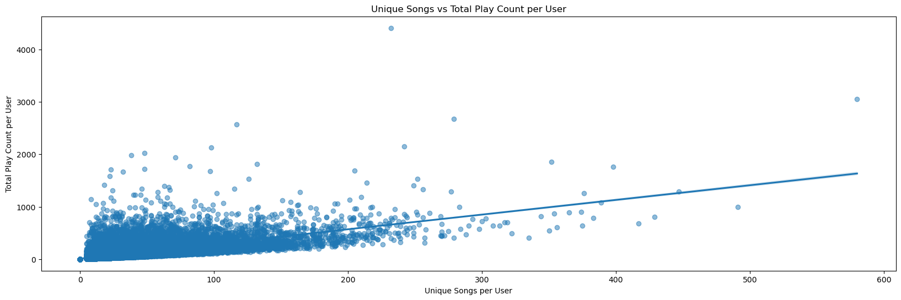
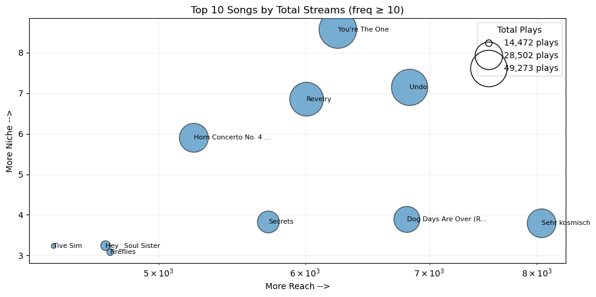
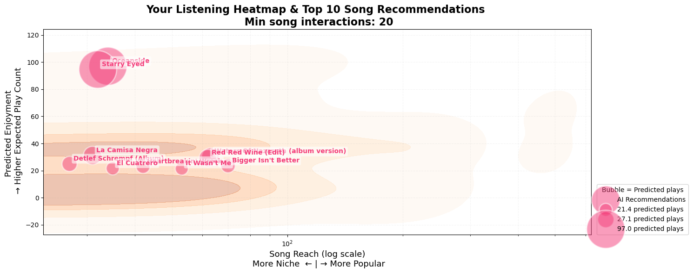
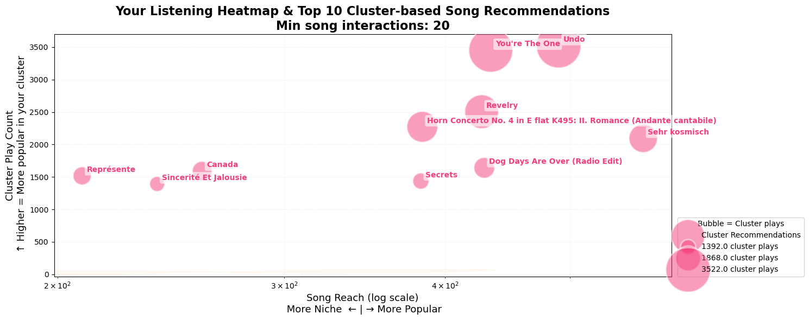

# Music Recommendation System

[](LICENSE)
[](https://python.org)
[](https://professional-education.mit.edu/)

> Capstone project for the MIT Applied Data Science Program (ADSP). A recommendation system that tackles decision fatigue in music streaming by learning from listener behavior to surface songs users are most likely to enjoy.

## Problem Statement

In the age of endless choices, **decision fatigue** has become a daily struggle for music listeners. This project builds a recommendation system that learns from a listener's history to generate a personalized top-N song list, reducing friction and improving discovery.

## Dataset

The [Million Song Dataset](http://millionsongdataset.com/) — a freely available collection of audio features and metadata for a million contemporary popular music tracks.

| File | Fields |
|------|--------|
| `count_data.csv` | `user_id`, `song_id`, `play_count` |
| `song_data.csv` | `song_id`, `title`, `release`, `artist_name`, `year` |

**Scale:** 2M user-song interactions across 76K+ users and 9.9K+ unique songs (after filtering).

<p align="center">
  
  <br><em>Exploratory analysis of user listening behavior — diversity vs. intensity</em>
</p>

## Approach

Five recommendation strategies were implemented and compared:

### 1. Popularity-Based (Baseline)
Ranks songs by average play count and listening frequency. Simple but effective as a benchmark.

<p align="center">
  
  <br><em>Top 10 most-streamed songs — bubble size reflects total play count</em>
</p>

### 2. User-User Collaborative Filtering (KNN)
Finds similar users based on listening patterns and recommends songs enjoyed by those neighbors.

### 3. Item-Item Collaborative Filtering (KNN)
Identifies similar songs based on co-listening patterns and recommends items similar to what the user already enjoys.

<p align="center">
  
  <br><em>User-User KNN recommendations overlaid on listening heatmap — pink bubbles are predicted songs</em>
</p>

### 4. Matrix Factorization (SVD / SVD++)
Decomposes the user-item interaction matrix into latent factors, capturing hidden patterns in listening behavior. SVD++ additionally incorporates implicit feedback signals.

### 5. Content-Based Filtering (TF-IDF)
Uses song metadata (title, artist, album, year) to build TF-IDF feature vectors and recommends songs with high cosine similarity to the user's profile.

A **K-Means clustering** approach was also explored to group users by behavior and recommend within clusters (best silhouette score: 0.925).

<p align="center">
  
  <br><em>KMeans cluster-based recommendations — songs popular within the user's behavioral cluster</em>
</p>

## Results

All collaborative filtering models evaluated at **@k=30** on a 70/30 train-test split:

| Model | Precision@k | Recall@k | F1@k | RMSE |
|-------|:-----------:|:--------:|:----:|:----:|
| User-User KNN (Baseline) | 76.5% | 85.7% | 80.8% | 4.14 |
| User-User KNN (Tuned) | 60.6% | 78.4% | 68.4% | 5.26 |
| Item-Item KNN (Baseline) | 75.6% | 85.5% | 80.2% | 2.93 |
| Item-Item KNN (Tuned) | 45.6% | 72.2% | 55.9% | 5.89 |
| SVD (Baseline) | 47.2% | 85.2% | 60.7% | 2209.7 |
| **SVD (Tuned)** | **53.6%** | **83.3%** | **65.2%** | **1.57** |
| SVD++ (Baseline) | 47.2% | 85.2% | 60.7% | 2209.7 |
| **SVD++ (Tuned)** | **52.9%** | **83.5%** | **64.8%** | **1.63** |

**Key takeaway:** Tuned SVD achieved the lowest RMSE (1.57) while maintaining strong recall, making it the best model for predicting play counts. KNN baselines showed the highest precision, making them suitable for top-N recommendation scenarios where precision matters most.

## How to Run

### Prerequisites

```bash
pip install numpy pandas matplotlib seaborn scikit-learn scikit-surprise nltk powerlaw
```

### Data

Download the dataset files from the [Million Song Dataset](http://millionsongdataset.com/) and place `count_data.csv` and `song_data.csv` in your working directory. Update the file paths in the notebook accordingly.

### Run

Open `Music_Recommendation_System.ipynb` in Jupyter Notebook or JupyterLab and run all cells.

## Project Structure

```
MIT_Capstone/
├── Music_Recommendation_System.ipynb   # Full analysis and modeling notebook
├── images/                             # Visualizations for README
├── README.md
├── LICENSE
└── .gitignore
```

## About

This project was completed as the capstone for the **MIT Applied Data Science Program (ADSP)**. It demonstrates end-to-end data science workflow: problem framing, EDA, feature engineering, model building, hyperparameter tuning, and evaluation across multiple recommendation paradigms.

## Other Projects

- [Twitch — Bird Submission Tracker](https://bird-submissions.vercel.app) | [GitHub](https://github.com/lukalacious/bird_submissions) — A full-stack Next.js app for tracking bird sightings, built with React 19, Prisma, Neon PostgreSQL, and Google OAuth.

## License

[MIT](LICENSE)
